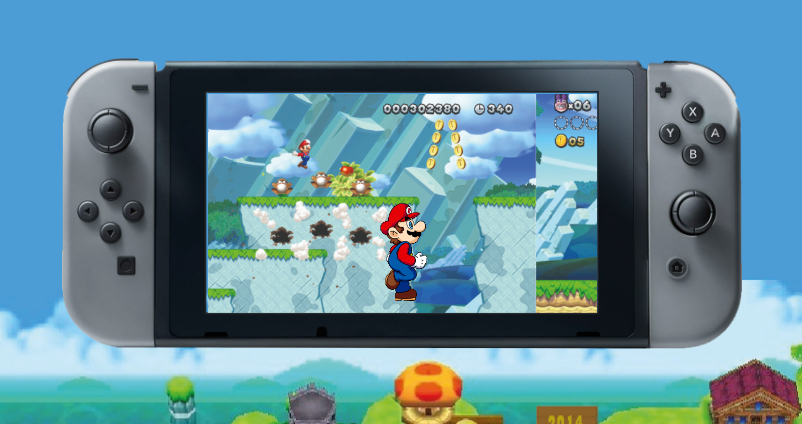

# Procesverslag

## Jij

### Ontwerper:
Zara Schriever

#### Je startniveau:
Mijn startniveau is: rood (maar een beetje paars)

# Je plan

  
Ik heb gekozen voor de tijdlijn opdracht en voor het personage Mario. Hierbij had ik bedacht om het spel
  Super Mario Bros na te gaan maken, elk jaar zie je dan de Nintendo en het spel zelf veranderen.
  
  Zoals in onderstaande schets te zien is, krijg je op het beginscherm een wereld van Super Mario Bros te zien, dit stelt 
  de tijdlijn voor. Wanneer je vervolgens op een jaartal klikt krijg je de Nintendo te zien van het bijpassende jaar. Op 
  elke Nintendo kan je Mario ook acties laten uitvoeren, zodat je een beetje het gevoel krijgt alsof je het spel aan het
  spelen bent.

  ### De eerste versie/schets:
  

  ### Je ambitie: 
  Aan deze technieken/punten wil ik werken:
  - JavaScript
  - Animaties met CSS maken
  - Beter worden als CSS

 

## Voortgang/Feedback 1

  
Bij het eerste feedback moment kwam ik erachter dat ik het toch iets te lastig voor mezelf had gemaakt. Daarom had ik het idee van de tijdlijn in de wereld maar even laten vallen en me vooral gefocust op de Nintendos zelf en de acties van Mario. 

  ### Bevinding 1:
  De feedback op mijn eerste idee was dat het misschien leuk was om easter eggs te verstoppen en/of ervoor te zorgen dat je op de knoppen kan klikken.

  #### oplossing:
  Ik wilde er al voor zorgen dat je op de knoppen kon klikken en dat Mario dan vervolgens zou gaan springen of rennen. Maar ik ben ook na gaan denken over een leuke easter egg.

  ### Bevinding 2:
  Ik zat te twijfelen of ik de Nintendos ging CSS'en of dat ik hier plaatjes voor ging gebruiken.

  #### oplossing:
  Het leek me leuk om de Nintendos zelf te CSS'en maar omdat ik dan 5 verschillende Nintendos zou moeten maken en ik aan het begin ook nog niet echt wist hoe ik dat zou moeten doen, had ik besloten om hier gewoon afbeeldingen voor te gebruiken. Wel wilde ik daarom wel veel andere acties en animaties toevoegen.

  ### Bevinding 3:
  Het was lastiger dan ik dacht om goede afbeelingen te vinden, hier was ik ook veel meer tijd aan kwijt dan ik had gehoopt. 

  #### oplossing:
  Uiteindelijk heb ik wel de meeste afbeeldingen gevonden, maar een aantal afbeelingen die ik zocht waren echt niet te vinden. Zo wilde ik wereld 1 op de achtergrond zetten met de tijdlijn erop, alleen kon ik geen afbeelding vinden waar de boven en onderkant niet afgesneden was. Dit was helaas niet te vinden dus heb ik het met één gedaan die dus wel een beetje afgesneden is.

## Voortgang/Feedback 2

  
Bij het tweede feedback moment was ik wel verder gekomen maar helaas nog niet zo ver als ik had gehoopt en er lukte ook nog een heleboel dingen niet. Gelukkig 

  

  ### Bevinding 1:
  De titel Super Mario staat nog een beetje random en past niet bij de rest van de pagina.

  #### oplossing:
  Omdat de titel niet heel mooi werd toen ik dit met clip-path probeerde heb ik de titel in het lettertype van het Mario Bros logo geschreven. Om het nog wat leuker te maken heb ik een animatie toegevoegd waarbij de letters 1 voor 1 naar binnen komen rollen aan het begin. Als je over de letters hovert springen ze ook een beetje omhoog.

  ### Bevinding 2:
  Het tekstvak dat naast de Nintendos komt te staan is nog niet helemaal goed uitgelijnd en er zit een rare animatie op.

  #### oplossing:
  Ik heb het tekstvlak met position absolute gepositioneerd omdat ik anders mijn hele code moest omgooien en dat te veel werk zou zijn. Ik had een margin-left en -right toegevoegd om hem op de goede plek te zetten, maar hierdoor lijnde het niet heel mooi uit. Dit heb ik veranderd naar "left: breedte van de nintendo + 4em". Hierdoor zit er tussen elke nintendo en tekst vak 4em ruimte.

  De gekke animatie kwam doordat het tekstvlak eest een andere positie kreeg, waardoor deze tijdens de animatie eerst nog hier langs ging. Deze positie heb ik verwijderd en nu heeft het tekstveld dezelfde animatie als de Nintendo.

  ### Bevinding 3:
  De jaartallen en de titel zijn niet heel goed te lezen op de rode achtergrond en lijkt nog niet precies op de letters in het spel zelf.

  #### oplossing:
  De letters stonden erg dicht op elkaar, ik heb de letter-spacing wat groter gemaakt, hierdoor kon je het al iets beter lezen. Ook heb ik een zwarte text-shadow op de tekst gezet, nu kan je de tekst goed lezen en lijkt het ook bijna precies op de letters uit het spel.

   ### Bevinding 4:
  Er is nog niet gebruik gemaakt van verschillende states op buttons en de interactieve elementen kunnen nog niet met het toetsenbord bediend worden.

  #### oplossing:
  Ik heb op de buttons aan de zijkant van het scherm verschillende states gegeven. Je kan nu zien dat je eroverheen hovert, welke je gefocust is en waar je op geklikt hebt. Met het toetsenbord kan je nu ook de acties van mario bedienen.

  ### Bevinding 5:
  In de HTML staan nog een aantal wrappers die niet nodig zijn, dus die zou je nog kunnen verwijderen.

  #### oplossing:
  Ik had articles toegevoegd waar dit niet nodig was, deze heb ik verwijderd zodat ik geen onnodige wrapper in mijn code heb staan.

## Voortgang/Feedback 3

  
Mijn bevindingen + wijzigingen (minimaal 5)

  
  ### Bevinding 1:
  Het tekstvak en de buttons zijn nog niet helemaal mooi uitgelijnd met de Nintendo in het midden.

  #### oplossing:
  Ik heb ervoor gezorgd dat de buttons, de Nintendo en het tekstvlak op de middenlijn worden uitgelijnd.

  ### Bevinding 2:
  Omschrijving van wat er nog niet orde was (tekst en afbeeding(en)).

  #### oplossing:
  Beschrijving hoe je het hebt hebt opgelost of als het niet gelukt is hoe je het zou oplossen (tekst en afbeeding(en)).

  ### Bevinding 3:
  ...

## Reflectie

  
Ik ben heel erg blij met het eindresultaat. Ik dacht eerst dat ik het te moeilijk voor mezelf gemaakt had en ik had tussendoor al wat ideeën geschrapt, maar aan het einde is toch alles gelukt wat ik aan het begin wilde. Ik was verbaasd over wat ik allemaal in twee weken heb kunnen maken. De basis van CSS kende ik wel redelijk maar heb het wel veel beter geleerd hierdoor. Ik kon ook nog niet goed animeren met CSS, dus ik ben blij dat ik dat nu wel kan.
  
  Ik had helemaal niet verwacht dat ik JavaScript hiervoor ging gebruiken omdat ik daar echt niet goed in was en daarom ook niet zo leuk vond. Maar toen ik eenmaal een paar regels had geschreven begon ik het al een beetje te snappen en ben ik het veel meer gaan gebruiken. Uiteindelijk heb ik meer dan 100 regels JavaScript geschreven en ben ik het ook echt leuk gaan vinden.
  
  

  ### Je uitkomst - karakteristiek screenshot(s):
  
  

  ### Dit ging goed/Heb ik geleerd: 
  Ik vond JavaScript altijd heel lastig, maar ik heb voor dit project veel met JavaScript gedaan en ben hier veel beter in geworden. Alle acties die Mario 'doet' heb ik met JavaScript gemaakt, zoals het springen en groeien bij de Nintendo Switch.

  

  Het leek me leuk om de titel met een animatie binnen te laten komen, ik had bedacht dat ik deze op hun plek wilde laten rollen. Het leek me heel erg moeilijk om te doen, maar dankzij een stukje code dat ik had gevonden was het eigenlijk heel makkelijk. 

  

  ### Dit was lastig/Is niet gelukt:
  Ik wilde wanneer je bij de Nintendo DS op het paddenstoeltje klikte er allemaal paddenstoeltjes uit de lucht zouden vallen. Met heel veel JavaScript wat ik had gevonden lukte dit. Maar helaas kreeg ik het niet voor elkaar om dit pas te laten gebeuren wanneer je op de paddenstoel klikt.

  

  Eigenlijk wilde ik ervoor zorgen dat je op elke Nintendo op elk knopje kon klikken en er dan wat gebeurde. Omdat dit nogal veel tijd koste en de code hier heel erg lang door zou worden heb ik dit niet gedaan. Maar als ik meer tijd zou hebbenn gehad had ik dit nog wel willen doen.

  

## Bronnenlijst

continu bijhouden terwijl je werkt

1. Scrollbar verbergen achtergrond nintendo - bron: https://www.w3schools.com/howto/howto_css_hide_scrollbars.asp
2. Animatie om de nintendo binnen te laten komen - bron: https://css-tricks.com/a-handy-little-system-for-animated-entrances-in-css/
3. Falling mushroom animatie - bron: https://www.kirupa.com/html5/the_falling_snow_effect.htm

